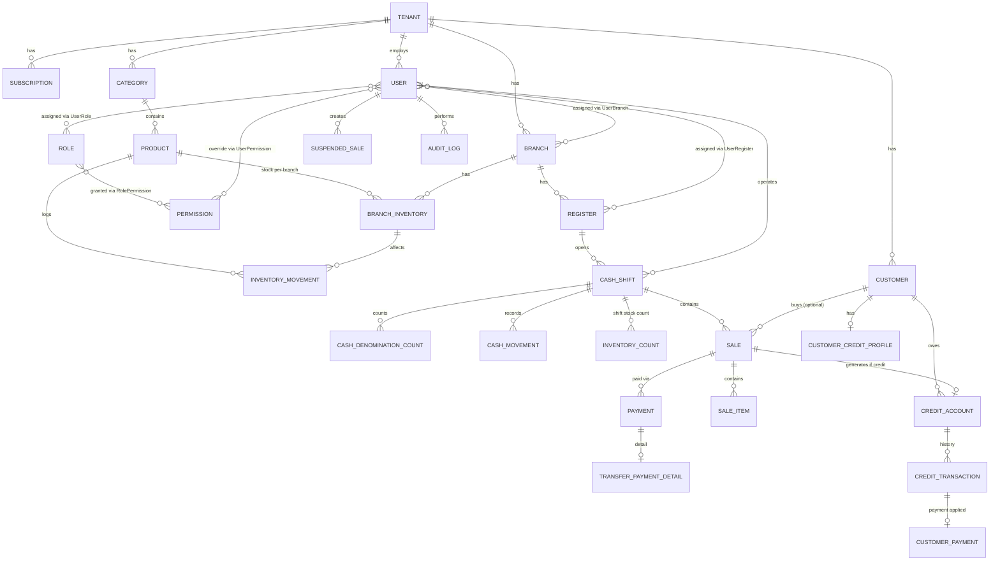
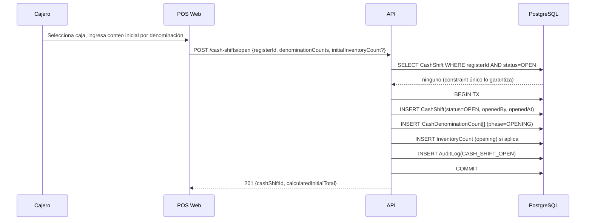
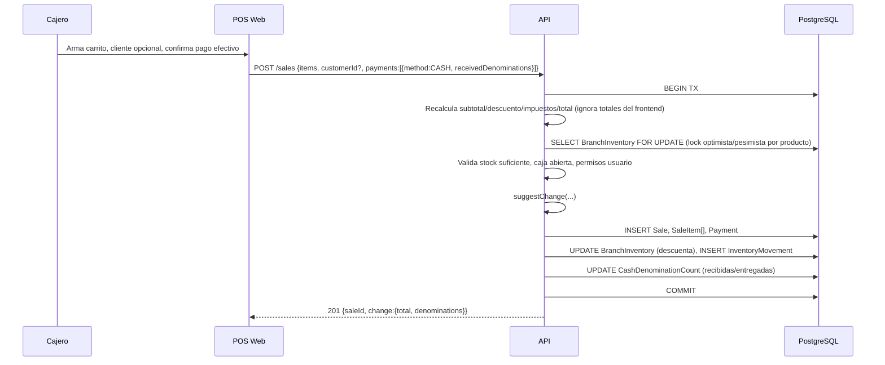
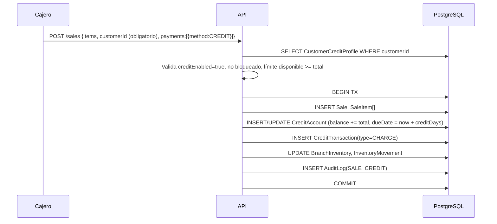
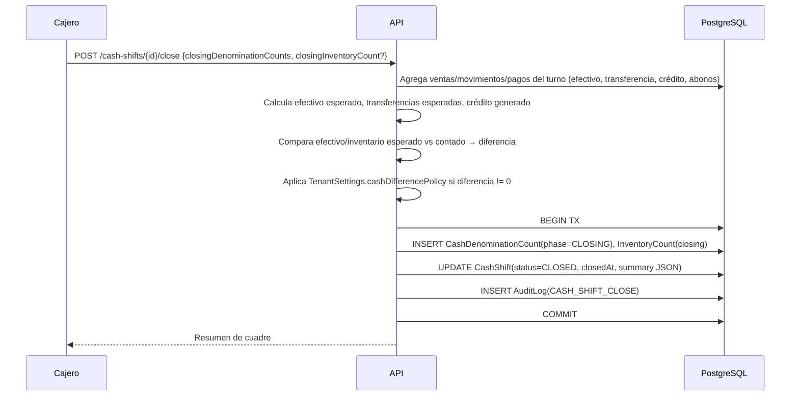

# DaleVenta — Diseño del Sistema (MVP + Roadmap)

**Fecha:** 2026-07-04
**Estado:** Aprobado para pasar a plan de implementación
**Base:** Fork de arquitectura de [TallerFacilRD](../../../TallerFacilRD) (mismo stack, mismo patrón multi-tenant)

## 1. Resumen ejecutivo

DaleVenta es un SaaS multi-tenant de punto de venta y gestión comercial. Primer cliente: una repostería. Diseñado para venderse luego a cafeterías, panaderías, minimarkets y comercios similares. Cubre: inventario de productos terminados, POS rápido, ventas contado/transferencia/crédito/mixtas, turnos de caja con conteo de denominaciones y sugerencia de cambio, cuentas por cobrar, roles y permisos granulares, multi-sucursal/multi-caja, dashboard, reportes y auditoría.

Se construye reutilizando el esqueleto ya probado de TallerFacilRD (Spring Boot 3 + Java 21, Next.js 15, PostgreSQL, Flyway, JWT, Docker) en lugar de partir de cero.

## 2. Alcance del MVP (Fase 1)

Incluye:
- Multi-tenant, auth JWT, RBAC granular (roles + permisos individuales).
- Empresas → sucursales → cajas (registers), asignación de usuarios.
- Productos, categorías, inventario por sucursal, alertas min/max.
- POS: carrito, búsqueda, código de barras, descuentos con permiso, notas, venta suspendida, cliente opcional ("Cliente de contado").
- Métodos de pago: efectivo, transferencia, crédito, mixto.
- Turnos de caja: apertura/cierre, conteo por denominaciones, algoritmo de sugerencia de cambio, cuadre efectivo/transferencia/crédito.
- Cuadre de inventario por turno (conteo inicial/final vs esperado).
- Clientes + perfil de crédito (límite, vencimiento, mora, abonos, cuentas por cobrar).
- Dashboard básico (ventas hoy/mes, cajas abiertas, stock bajo, créditos pendientes).
- Auditoría de operaciones sensibles.
- Panel superadmin / planes de suscripción (reutilizado casi intacto de TallerFacilRD).

Excluido de Fase 1 (ver §3): reportes exportables avanzados, devoluciones/anulaciones con flujo de autorización completo, notificaciones, portal de cliente, materias primas/recetas/producción.

## 3. Fases posteriores

**Fase 2:** reportes avanzados (PDF/Excel/CSV), devoluciones y anulaciones con autorización de Administrador, notificaciones internas, portal de cliente (consulta de historial/deuda).

**Fase 3:** materias primas, recetas, producción (BOM) — específico de repostería/panadería, no bloquea venta a otros rubros. Analítica avanzada (rentabilidad, forecasting).

## 4. Mapeo de reutilización desde TallerFacilRD

| Módulo TallerFacilRD | Acción en DaleVenta |
|---|---|
| `auth` | Reusar, extender con permisos granulares por usuario (hoy son roles fijos) |
| `tenant` | Reusar tal cual |
| `superadmin` | Reusar tal cual (planes, suspensión, impersonación auditada) |
| `shared` (config/storage/ratelimit) | Reusar tal cual |
| `dashboard` | Reusar estructura, cambiar queries al dominio de ventas |
| `reports` | Reusar estructura, nuevos reportes de ventas/crédito/inventario |
| `payment` | Reusar base, extender a pagos mixtos y pagos de crédito |
| `customer` | Reusar, agregar `CustomerCreditProfile` |
| `cash` | Reemplazar por `cashshift` (turnos, denominaciones, cuadre) |
| `inventory` | Reescribir dominio: productos terminados en vez de repuestos, por sucursal |
| `workorder`, `vehicle`, `reception`, `quote`, `reminder`, `portal` | Eliminar (no aplica a venta al detalle) |
| `announcement` | Reusar opcionalmente (avisos superadmin → tenants) |
| — | Nuevos: `branch`, `register`, `product`/`category`, `pos`, `credit`, `permission`, `audit`, `return` (fase 2) |

## 5. Actores

- **Superadmin (SaaS):** gestiona tenants, planes, suscripciones, soporte, impersonación auditada.
- **Administrador del negocio:** gestiona sucursales, cajas, usuarios, roles, permisos, productos, clientes, crédito, ve todos los reportes y auditoría, autoriza toda operación sensible (descuentos altos, anulaciones, diferencias de caja/inventario, reaperturas).
- **Cajero:** opera POS y su turno según permisos asignados. No ve costos/ganancias salvo permiso explícito.
- **Cliente (fase 2, portal):** consulta su historial y deuda.

## 6. RBAC — modelo de permisos

`Role` (plantilla, por tenant, personalizable) + `Permission` (catálogo fijo del sistema) + `RolePermission` (N:M) + `UserRole` (N:M) + **override individual** `UserPermission` (permite otorgar/revocar un permiso puntual a un usuario sin tocar su rol — cubre "permisos individuales" del requerimiento).

Resolución efectiva de un permiso para un usuario = `(permisos del rol) UNION (UserPermission GRANT) MINUS (UserPermission REVOKE)`.

Catálogo inicial de permisos (extensible): `inventory.view`, `inventory.create`, `inventory.edit`, `inventory.adjust`, `cost.view`, `price.view`, `sale.create`, `sale.discount`, `sale.price_override`, `sale.void`, `sale.return`, `cashshift.open`, `cashshift.close`, `cashshift.view_history`, `customer.create`, `customer.edit`, `credit.authorize`, `credit.receive_payment`, `reports.view`, `profit.view`, `users.manage`, `settings.manage`.

Cada usuario además se limita a las sucursales/cajas asignadas (`UserBranch`, `UserRegister`); un cajero no puede operar una caja fuera de su asignación.

Operaciones sensibles (anulación, devolución, descuento > umbral configurable, ajuste de inventario, reapertura de turno, corrección de caja) soportan **autorización por segundo usuario**: se registra `authorizedByUserId` en el `AuditLog` y en la entidad afectada.

## 7. Modelo de datos — entidades núcleo

```
Tenant, SubscriptionPlan, Subscription          (reusado)
Branch, Register                                (nuevo)
User, Role, Permission, RolePermission, UserRole,
UserPermission, UserBranch, UserRegister         (extendido)
Category, Product, ProductPrice, BranchInventory,
InventoryMovement                                (nuevo dominio)
Customer, CustomerCreditProfile                  (extendido)
Sale, SaleItem, Payment, TransferPaymentDetail    (nuevo/adaptado)
CreditAccount, CreditTransaction, CustomerPayment (nuevo)
CashShift, Denomination, CashDenominationCount,
CashMovement                                     (nuevo, reemplaza `cash`)
InventoryCount                                    (nuevo — cuadre por turno)
SuspendedSale                                     (nuevo)
Return, ReturnItem                                (fase 2)
AuditLog, Notification                            (reusado/extendido)
```

### 7.1 Diagrama entidad-relación (núcleo Fase 1)



### 7.2 Notas de diseño clave

- **`BranchInventory`** (no `ProductInventory` global): existencia vive por sucursal; `InventoryMovement` referencia siempre `branchId`. Transferencias entre sucursales = dos movimientos ligados (salida origen + entrada destino) en una transacción.
- **Dinero:** todos los campos monetarios `NUMERIC(14,2)` (o `NUMERIC(14,4)` para precios unitarios si se requiere fracción de centavo en costo). Nunca `float`/`double`.
- **Denominación:** catálogo `Denomination(tenantId, value, type[BILL|COIN], active)` configurable por tenant/moneda. `CashDenominationCount(cashShiftId, denominationId, quantity, phase[OPENING|CLOSING])`.
- **Borrado lógico:** `Product.active`, `Customer.active`, nunca DELETE físico sobre entidades con historial (`Sale`, `Payment`, `CreditAccount`, etc.). Ver §14 casos especiales.
- **Índices obligatorios:** `(tenantId, branchId)` en todas las tablas transaccionales; `(tenantId, customerId)` en Sale/CreditAccount; `(cashShiftId)` en Sale/CashMovement; único parcial `(registerId) WHERE status = 'OPEN'` en CashShift (impide doble turno abierto).

## 8. Reglas de negocio clave (resueltas / contradicciones del pedido original)

1. Una caja (`Register`) no puede tener dos `CashShift` con `status = OPEN` simultáneamente — constraint único parcial en BD, no solo validación de aplicación.
2. Venta a crédito exige `Customer` real con `CustomerCreditProfile.creditEnabled = true`; el "Cliente de contado" del tenant tiene `creditEnabled` bloqueado permanentemente por regla de aplicación.
3. El backend recalcula siempre: subtotal, descuento, impuestos, total, cambio, inventario disponible, crédito disponible, efectivo esperado — el frontend nunca es fuente de verdad (§13 requisito técnico explícito del pedido).
4. Diferencias de caja/inventario **no bloquean el cierre por defecto**; el tenant configura (`TenantSettings.cashDifferencePolicy`) si se: bloquea, permite con autorización, o solo se registra. Evita el deadlock de "no puedo cerrar turno nunca".
5. Si no hay combinación exacta de denominaciones para el cambio, la venta **no se bloquea**: se ofrece combinación más cercana por exceso (con confirmación) o falta, según `TenantSettings.changeShortagePolicy` (ver §9).
6. Anulación de venta después del cierre del turno: permitida solo a Administrador, genera un `CashMovement` de ajuste en el turno **actual** (no reabre el turno cerrado) + registro de auditoría enlazando la venta original.
7. Reapertura de turno cerrado: exclusivamente Administrador, requiere motivo, genera `AuditLog` con acción `CASH_SHIFT_REOPEN`.

## 9. Algoritmo de cambio por denominaciones

**Objetivo:** dado un monto de cambio y las denominaciones disponibles en la caja (después de sumar el efectivo recibido en la venta), encontrar la combinación válida con **menor cantidad total de piezas**.

**Pseudocódigo (programación dinámica, minimizar conteo de piezas):**

```
function suggestChange(changeAmountCents, availableDenominations):
    # availableDenominations: lista de {valueCents, quantityAvailable}, orden desc por valor
    dp = array[0..changeAmountCents] inicializado a INFINITO
    dp[0] = 0
    usedCount = array[0..changeAmountCents] de mapas vacíos  # denominationId -> qty usada

    for amount in 1..changeAmountCents:
        for denom in availableDenominations:
            if denom.valueCents > amount: continue
            prevUsed = usedCount[amount - denom.valueCents]
            if prevUsed is INFEASIBLE: continue
            qtyOfThisDenomAlreadyUsed = prevUsed.get(denom.id, 0)
            if qtyOfThisDenomAlreadyUsed + 1 > denom.quantityAvailable: continue
            candidatePieces = dp[amount - denom.valueCents] + 1
            if candidatePieces < dp[amount]:
                dp[amount] = candidatePieces
                usedCount[amount] = copy(prevUsed) + {denom.id: qtyOfThisDenomAlreadyUsed + 1}

    if dp[changeAmountCents] == INFINITO:
        return NO_EXACT_COMBINATION   # dispara política de faltante de cambio (regla 5)
    return usedCount[changeAmountCents]
```

**Complejidad:** O(monto_en_unidad_mínima × número_denominaciones) — trivial en RD$ (montos típicos < 50,000, ~10 denominaciones). Se opera en **centavos enteros** (`long`), nunca en `float`, para evitar arrastre de error.

**Flujo de venta en efectivo:**
1. Backend recalcula total de la venta.
2. Cajero registra denominaciones recibidas del cliente (o solo el monto total, si el negocio no exige detalle de recepción).
3. Backend valida `montoRecibido >= total`; si no, rechaza (regla: "monto menor al total" → §14).
4. Backend suma temporalmente las denominaciones recibidas al stock de caja disponible (aumenta `quantityAvailable`, sin persistir todavía).
5. Ejecuta `suggestChange(recibido - total, stockDisponibleActualizado)`.
6. Si hay combinación: la muestra, cajero confirma o pide otra combinación válida (el endpoint puede recibir un `excludeDenominationId` y recalcular).
7. Si no hay combinación exacta: aplica `TenantSettings.changeShortagePolicy` (`BLOCK` | `ALLOW_WITH_AUTHORIZATION` | `REGISTER_DIFFERENCE` | `REQUEST_OTHER_AMOUNT`).
8. Al confirmar, persiste `Sale`, `Payment`, y actualiza `CashDenominationCount` de la caja en la misma transacción (+recibidas, −entregadas de cambio).

## 10. Flujos principales (secuencia)

### 10.1 Apertura de turno


### 10.2 Venta en efectivo


### 10.3 Venta a crédito


### 10.4 Cierre de turno


## 11. Mapa de pantallas (Fase 1)

Login · Registro de empresa · Dashboard (admin/cajero) · **POS** (carrito + cliente + pago + cambio) · Selección/registro rápido de cliente · Apertura de caja (denominaciones + inventario inicial) · Cierre de caja (conteo + cuadre) · Productos · Categorías · Inventario y movimientos · Clientes · Perfil de cliente (crédito, historial) · Cuentas por cobrar + registro de abonos · Ventas (listado + detalle) · Usuarios · Roles y permisos · Sucursales · Cajas · Configuración (denominaciones, políticas de diferencia, impuestos, moneda) · Auditoría · Super-admin (tenants, planes).

El POS prioriza mínimos clics: buscador con foco automático, atajos de teclado para cantidad/cobro, un solo modal de pago con los 4 métodos.

## 12. API — endpoints representativos

```
POST   /api/v1/auth/login
POST   /api/v1/tenants/register

GET    /api/v1/branches            POST /api/v1/branches
GET    /api/v1/registers           POST /api/v1/registers

GET    /api/v1/products            POST /api/v1/products
PATCH  /api/v1/products/{id}/stock-thresholds
GET    /api/v1/inventory/movements
POST   /api/v1/inventory/adjustments
POST   /api/v1/inventory/transfers

POST   /api/v1/cash-shifts/open
POST   /api/v1/cash-shifts/{id}/close
GET    /api/v1/cash-shifts/{id}/summary
POST   /api/v1/cash-shifts/{id}/movements        # entrada/retiro efectivo

POST   /api/v1/sales
POST   /api/v1/sales/{id}/void                   # requiere authorizedByUserId
POST   /api/v1/sales/change-suggestion           # preview del algoritmo, sin persistir
POST   /api/v1/sales/suspended                   # suspender/recuperar

GET    /api/v1/customers           POST /api/v1/customers
GET    /api/v1/customers/{id}/credit-account
POST   /api/v1/credit-accounts/{id}/payments

GET    /api/v1/reports/sales?from=&to=&branchId=&method=
GET    /api/v1/audit-log?entity=&from=&to=
```

### Ejemplo — sugerencia de cambio

Request:
```json
POST /api/v1/sales/change-suggestion
{
  "registerId": "reg_123",
  "totalCents": 135000,
  "receivedDenominations": [{ "denominationId": "d_2000", "quantity": 1 }]
}
```

Response (caso feliz):
```json
{
  "receivedTotalCents": 200000,
  "changeTotalCents": 65000,
  "combination": [
    { "denominationId": "d_500", "quantity": 1 },
    { "denominationId": "d_100", "quantity": 1 },
    { "denominationId": "d_50", "quantity": 1 }
  ],
  "exact": true
}
```

Response (sin combinación exacta):
```json
{
  "receivedTotalCents": 200000,
  "changeTotalCents": 65000,
  "combination": null,
  "exact": false,
  "message": "No hay suficientes denominaciones para devolver el cambio exacto",
  "policy": "ALLOW_WITH_AUTHORIZATION"
}
```

## 13. Casos especiales — resolución

| Caso | Resolución |
|---|---|
| Dos cajeros venden la última unidad | Lock a nivel de fila (`SELECT ... FOR UPDATE`) sobre `BranchInventory` dentro de la transacción de venta; el segundo request falla con `409 INSUFFICIENT_STOCK` y refresca carrito |
| Se pierde conexión durante venta | Venta no confirmada = no persistida (transacción atómica); frontend reintenta con `idempotencyKey` para evitar duplicados |
| Monto entregado < total | Rechazo `400`, no se permite confirmar el pago |
| Sin denominaciones para cambio exacto | Política configurable (§8.5) |
| Vender sin caja abierta | Bloqueado a nivel de API: toda venta exige `cashShiftId` con `status=OPEN` |
| Cerrar caja con venta suspendida pendiente | Permitido pero advertido; ventas suspendidas no cuentan en el cuadre hasta recuperarse/completarse |
| Transferencia con referencia duplicada | Índice único `(tenantId, bankReference)` opcional configurable; si el tenant lo activa, `409 DUPLICATE_REFERENCE` |
| Cliente excede límite de crédito | `400 CREDIT_LIMIT_EXCEEDED`, venta a crédito rechazada (puede completarse como mixta) |
| Cliente con facturas vencidas | Configurable: bloqueo automático de nuevo crédito (`CustomerCreditProfile.autoBlockOnOverdue`) |
| Anular venta tras cierre | Solo Administrador; ver regla §8.6 |
| Inventario físico no coincide | Diferencia registrada en `InventoryCount`, requiere observación + aprobación según política |
| Efectivo contado no coincide | Diferencia registrada en `CashShift.summary`, requiere observación + aprobación según política |
| Usuario pierde permiso con sesión abierta | JWT de corta vida (15 min) + verificación de permisos en cada request contra estado actual en BD (no solo claims del token) |
| Admin modifica venta finalizada | No se edita: se anula + se crea venta de ajuste, ambas enlazadas y auditadas |
| Dos usuarios cierran misma caja | Constraint único parcial + optimistic locking (`version` en `CashShift`) → segundo request `409 CONFLICT` |
| Caja usada desde otra sucursal | `UserRegister`/`Register.branchId` valida que el usuario y la caja pertenezcan a la sucursal de la sesión |
| Eliminar producto con ventas históricas | Borrado lógico (`active=false`), nunca DELETE; `SaleItem` conserva snapshot de nombre/precio al momento de la venta |

## 14. Seguridad y auditoría

- JWT access (15 min) + refresh token rotable, revocable por tenant.
- RBAC + permisos individuales verificados en backend en cada endpoint (no confiar en UI).
- Rate limiting (reusa `shared/ratelimit` de TallerFacilRD) en login y endpoints de venta.
- `AuditLog` inmutable (solo INSERT) para: login, cambios de permisos, ajustes de inventario, descuentos, cambios de precio, anulaciones, devoluciones, movimientos de efectivo, apertura/cierre/reapertura de turno, ventas a crédito, cambios de límite de crédito, impersonación de superadmin.
- Backups automatizados de PostgreSQL (mismo mecanismo que TallerFacilRD).
- Zona horaria: almacenar en UTC (`TIMESTAMPTZ`), mostrar en zona horaria del tenant (`America/Santo_Domingo` por defecto).

## 15. Riesgos técnicos

- **Concurrencia en inventario/caja:** mitigado con locks a nivel de fila + constraints únicos parciales en BD (no solo validación en Java).
- **Algoritmo de cambio con muchas denominaciones/montos grandes:** complejidad aceptable para montos de comercio al detalle; si se necesita, cachear resultados por (monto, snapshot de stock) durante la sesión de venta.
- **Migración desde TallerFacilRD:** riesgo de arrastrar acoplamientos del dominio de taller; mitigar copiando solo `auth`, `tenant`, `superadmin`, `shared` primero, y reescribiendo el resto desde el modelo de datos de §7.
- **Doble turno abierto / doble cierre:** mitigado con constraint de BD, no solo lógica de aplicación.

## 16. Stack técnico (heredado de TallerFacilRD)

Spring Boot 3 · Java 21 · PostgreSQL · Flyway · Spring Security + JWT · Next.js 15 · React 19 · TypeScript · Docker/Docker Compose · Nginx · JUnit 5 · Testcontainers · MockMvc.
