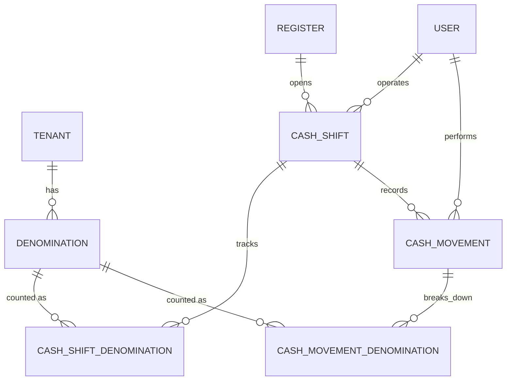

# CashShift / Denominaciones / Algoritmo de Cambio — Diseño

**Fecha:** 2026-07-05
**Estado:** Aprobado para pasar a plan de implementación
**Depende de:** [Bootstrap + RBAC + Branch/Register](2026-07-04-dalventa-design.md), [Product/BranchInventory](2026-07-05-product-inventory-design.md) (ambos mergeados a `main`)
**Precede a:** POS/Sale (venta al detalle, pagos, descuento de inventario), Credit/CuentasPorCobrar

## 1. Resumen

Tercer módulo de dominio: turnos de caja (`CashShift`) por `Register`, catálogo de denominaciones (`Denomination`) por tenant, conteo de efectivo por denominación en apertura/cierre, movimientos manuales de efectivo (entrada/retiro/gasto), y el algoritmo de sugerencia de cambio. **No incluye `Sale`** — ese es el siguiente módulo del roadmap. Todo lo que este módulo cuadra al cierre (`expectedCash`) se calcula únicamente a partir de la apertura y los movimientos manuales registrados en este módulo; cuando el módulo POS/Sale exista, sumará su propia línea (ventas en efectivo) al mismo cálculo sin requerir cambios de esquema aquí — la fórmula de cierre está diseñada para extenderse, no para rehacerse.

## 2. Alcance de este módulo

**Incluido:**
- `Denomination`: catálogo por tenant (billetes/monedas, valor, activo). Sembrado automáticamente con el catálogo de República Dominicana al registrar un tenant nuevo (mismo punto donde hoy se crea el tenant + usuario admin).
- `CashShift`: apertura/cierre de turno por `Register`, con la restricción de que una caja no puede tener dos turnos `OPEN` simultáneos (constraint de base de datos, no solo validación de aplicación).
- `CashShiftDenomination`: una fila por (turno, denominación) que guarda `openingQuantity` (inmutable tras la apertura), `currentQuantity` (balance vivo, mutado por movimientos manuales) y `closingQuantity` (nulo hasta el cierre).
- `CashMovement`: entradas, retiros y gastos menores de efectivo durante el turno, cada uno con desglose de denominaciones, motivo, usuario y fecha — mutan `currentQuantity`.
- Algoritmo de sugerencia de cambio: endpoint de **preview puro** (no persiste nada) que, dado un monto de cambio y las denominaciones que el cliente entrega, calcula la combinación de menor cantidad de piezas usando el `currentQuantity` del turno abierto de esa caja.
- Cierre de turno con cálculo de `expectedCash` (fondo inicial + entradas − retiros − gastos, sin ventas todavía), conteo de `closingQuantity`, y diferencia registrada (nunca bloquea el cierre).

**Explícitamente fuera de alcance (diferido):**
- `Sale`/`Payment` — el siguiente módulo. El cálculo de cierre gana una línea "ventas en efectivo" cuando ese módulo exista; no se prepara un campo vacío para eso aquí (YAGNI — se agrega cuando exista el dato real).
- `TenantSettings`/política configurable de diferencias (bloquear / permitir con autorización / solo registrar). Este módulo fija la política a "nunca bloquea, siempre se registra" — si se necesita configurabilidad, es una migración aditiva en un módulo posterior, no un rediseño.
- Reapertura de turno cerrado (requiere rol Administrador + auditoría dedicada — se añade cuando haya presión real de negocio para eso, no ahora).
- Cuadre de inventario por turno (`InventoryCount`) — pertenece al módulo POS/Sale, que es quien realmente descuenta inventario.

## 3. Modelo de datos

### 3.1 Entidades

```
Denomination (tenant-scoped)
  - value: BigDecimal(12,2)
  - type: enum { BILL, COIN }
  - active: boolean (default true)

CashShift (tenant-scoped)
  - registerId: UUID (FK -> registers)
  - status: enum { OPEN, CLOSED }
  - openedBy: UUID (FK -> users)
  - openedAt: Instant
  - closedAt: Instant (nullable)
  - openingTotal: BigDecimal(14,2)      // suma de openingQuantity * value, calculado al abrir
  - expectedCash: BigDecimal(14,2)      // calculado al cerrar
  - countedCash: BigDecimal(14,2)       // suma de closingQuantity * value, calculado al cerrar
  - cashDifference: BigDecimal(14,2)    // countedCash - expectedCash
  - closingNotes: String (nullable; obligatorio en servicio si cashDifference != 0)

CashShiftDenomination (tenant-scoped)
  - cashShiftId: UUID (FK -> cash_shifts)
  - denominationId: UUID (FK -> denominations)
  - openingQuantity: int
  - currentQuantity: int
  - closingQuantity: Integer (nullable hasta el cierre)
  - UNIQUE (cash_shift_id, denomination_id)

CashMovement (tenant-scoped)
  - cashShiftId: UUID (FK -> cash_shifts)
  - type: enum { ENTRY, WITHDRAWAL, EXPENSE }
  - amount: BigDecimal(14,2)             // suma de denominación * cantidad del desglose
  - reason: String
  - userId: UUID (FK -> users)
  // El desglose de denominaciones de cada movimiento vive en CashMovementDenomination
  // (tabla hija), no como columna — un movimiento puede tocar varias denominaciones a la vez.

CashMovementDenomination (tenant-scoped)
  - cashMovementId: UUID (FK -> cash_movements)
  - denominationId: UUID (FK -> denominations)
  - quantity: int
```

### 3.2 Diagrama entidad-relación



### 3.3 Reglas de negocio

1. **Un solo turno `OPEN` por caja.** Índice único parcial en Postgres: `CREATE UNIQUE INDEX ... ON cash_shifts(register_id) WHERE status = 'OPEN'`. Un intento de abrir un segundo turno en la misma caja falla a nivel de base de datos con violación de constraint (mapeado a 409), no solo con una validación de aplicación que podría perder una condición de carrera.
2. **`currentQuantity` es la única fuente de verdad para el algoritmo de cambio.** Al abrir el turno, `currentQuantity = openingQuantity` para cada denominación. Cada `CashMovement` de tipo `ENTRY` suma su desglose a `currentQuantity`; `WITHDRAWAL`/`EXPENSE` lo resta (y se rechaza con 400 si dejaría alguna denominación en negativo).
3. **El algoritmo de cambio nunca persiste nada.** Es un cálculo de "qué pasaría si" sobre `currentQuantity` + las denominaciones que el cliente dice haber entregado, sumadas temporalmente en memoria. Cuando el módulo POS/Sale exista, será ese módulo el que, tras confirmar la venta, registre el `CashMovement` real que efectivamente descuenta las denominaciones entregadas como cambio — este módulo no lo hace porque no hay venta que confirmar todavía.
4. **Diferencia de cierre nunca bloquea.** Se calcula, se guarda en `CashShift.cashDifference`, y se exige `closingNotes` no vacío únicamente cuando la diferencia es distinta de cero (validación de servicio, no constraint de base de datos, ya que el 90% de los cierres no tendrán diferencia y no necesitan nota).
5. **Borrado lógico / inmutabilidad histórica:** ningún `CashShift` cerrado se modifica. `Denomination.active = false` para desactivar sin perder historial de conteos que la referencian.

## 4. Algoritmo de sugerencia de cambio

Idéntico al pseudocódigo de la especificación general (programación dinámica, minimizar cantidad de piezas), operando en **centavos enteros** (`long`), nunca en `BigDecimal`/`float` durante el cálculo — la conversión `BigDecimal ⇄ centavos long` ocurre solo en los bordes (lectura de `Denomination.value`, escritura de la respuesta).

```
function suggestChange(changeAmountCents: long, available: List<{denominationId, valueCents, quantityAvailable}>): Result

    dp = array[0..changeAmountCents] de INFINITO; dp[0] = 0
    usedCount = array[0..changeAmountCents] de mapas vacíos (denominationId -> qty)

    for amount in 1..changeAmountCents:
        for denom in available:
            if denom.valueCents > amount: continue
            prev = usedCount[amount - denom.valueCents]
            if prev is INFEASIBLE: continue
            alreadyUsed = prev.get(denom.id, 0)
            if alreadyUsed + 1 > denom.quantityAvailable: continue
            candidate = dp[amount - denom.valueCents] + 1
            if candidate < dp[amount]:
                dp[amount] = candidate
                usedCount[amount] = copy(prev) + {denom.id: alreadyUsed + 1}

    if dp[changeAmountCents] == INFINITO: return NoExactCombination
    return usedCount[changeAmountCents]
```

**Endpoint:** `POST /api/cash-shifts/change-suggestion`

Request: `{ registerId, changeAmountCents, receivedDenominations: [{denominationId, quantity}] }`

Flujo del servicio:
1. Resuelve el turno `OPEN` de `registerId` (tenant-scoped); 404 si no hay turno abierto.
2. Construye la lista `available` a partir de `CashShiftDenomination.currentQuantity` de ese turno.
3. Suma temporalmente `receivedDenominations` a `available` (sin persistir).
4. Corre `suggestChange`.
5. Responde con la combinación o `{exact: false}` si no hay combinación exacta — nunca un error 4xx/5xx por falta de cambio exacto, es un resultado válido del cálculo que el llamador (futuro POS) decide cómo manejar.

## 5. Endpoints

```
GET    /api/denominations                                  # catálogo del tenant
POST   /api/denominations                                  # agregar denominación (SETTINGS_MANAGE)

POST   /api/cash-shifts/open                                # {registerId, openingCounts:[{denominationId,quantity}]}
POST   /api/cash-shifts/{id}/close                          # {closingCounts:[...], closingNotes?}
GET    /api/cash-shifts/{id}/summary                        # totales + desglose de denominaciones
GET    /api/cash-shifts?registerId=                          # historial (CASHSHIFT_VIEW_HISTORY)
POST   /api/cash-shifts/{id}/movements                       # {type, reason, denominations:[{denominationId,quantity}]}
POST   /api/cash-shifts/change-suggestion                    # preview, no persiste
```

**Permisos:** `CASHSHIFT_OPEN` cubre abrir el turno Y registrar movimientos (entrada/retiro/gasto) — no se agrega un código nuevo, ya que operar la caja abierta es la misma autoridad que abrirla. `CASHSHIFT_CLOSE` para cerrar. `CASHSHIFT_VIEW_HISTORY` para listar turnos pasados. `GET /api/cash-shifts/{id}/summary` y `POST /api/cash-shifts/change-suggestion` requieren `CASHSHIFT_OPEN` (son parte de operar el turno activo). `POST /api/denominations` requiere `SETTINGS_MANAGE` (mismo código que `Branch`).

## 6. Casos especiales

| Caso | Resolución |
|---|---|
| Abrir turno en caja que ya tiene uno `OPEN` | `409`, vía constraint único parcial de BD |
| Cerrar turno ya cerrado | `409`/`400` — el servicio valida `status == OPEN` antes de cerrar |
| Retiro/gasto que dejaría una denominación en negativo | `400`, no se persiste el movimiento |
| Sugerencia de cambio sin turno abierto en esa caja | `404` |
| Sugerencia de cambio sin combinación exacta | `200` con `exact: false` — no es un error, es un resultado |
| Cierre con diferencia de efectivo | Se permite siempre; `closingNotes` obligatorio solo si `cashDifference != 0` |
| Caja de otro tenant | `404`, mismo patrón `ResourceNotFoundException` ya establecido (no `ResponseStatusException` — ver nota técnica §7) |

## 7. Riesgos técnicos y notas de la codebase

- **Constraint de un solo turno abierto:** debe ser un índice único parcial en la migración (`WHERE status = 'OPEN'`), no solo una validación `find-then-check` en el servicio — dos requests simultáneos de apertura en la misma caja deben chocar en la base de datos, no en una carrera de aplicación.
- **Lección de módulos anteriores:** nunca usar `org.springframework.web.server.ResponseStatusException` desnudo — el `@ExceptionHandler(Exception.class)` catch-all de este proyecto lo intercepta antes que Spring aplique el status code, devolviendo 500 en vez del status querido. Usar siempre `ResourceNotFoundException` (404), `IllegalArgumentException` (400, ya mapeado) o una excepción nueva mapeada explícitamente en `GlobalExceptionHandler` si se necesita otro código (ej. 409 para "turno ya abierto").
- **Jackson SNAKE_CASE global:** todo campo camelCase multi-palabra en un DTO de request/response (`registerId`, `changeAmountCents`, `openingCounts`, `denominationId`, `cashDifference`, etc.) necesita `@JsonProperty("nombreExactoCamelCase")` explícito.
- **Dinero:** `Denomination.value`, `CashShift.openingTotal/expectedCash/countedCash/cashDifference`, `CashMovement.amount` son todos `BigDecimal`. Solo el núcleo del algoritmo de cambio (`suggestChange`) trabaja en `long` centavos, y esa conversión ocurre en los bordes del servicio, no se propaga a las entidades.
- **Migraciones:** el directorio termina actualmente en `V13__inventory_movements.sql`; este módulo continúa desde `V14`.
