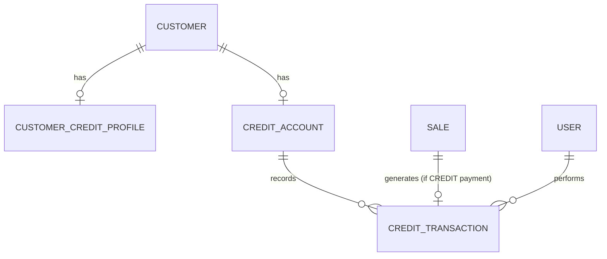

# Credit / Cuentas por Cobrar — Diseño

**Fecha:** 2026-07-05
**Estado:** Aprobado para pasar a plan de implementación
**Depende de:** [POS/Sale](2026-07-05-pos-sale-design.md), [Product/BranchInventory](2026-07-05-product-inventory-design.md), [CashShift/Denominaciones](2026-07-05-cashshift-denominaciones-design.md) (todos mergeados a `main`)
**Precede a:** Fase 2 (reportes, devoluciones parciales, portal cliente)

## 1. Resumen

Quinto módulo de dominio: venta a crédito y cuentas por cobrar. Extiende `Sale`/`PaymentMethod` (ya existente) con un tercer método de pago (`CREDIT`), y agrega el saldo de crédito por cliente. Simplificado deliberadamente respecto al diseño maestro original: **un solo balance corrido por cliente**, no una cuenta individual por venta con vencimiento propio, y **sin bloqueo automático por mora** — ambas simplificaciones decididas explícitamente para mantener el MVP enfocado (ver §2).

## 2. Alcance de este módulo

**Incluido:**
- `CustomerCreditProfile`: habilita/deshabilita crédito por cliente y fija su límite.
- `CreditAccount`: un balance vivo por cliente (mismo patrón que `BranchInventory.currentStock`/`CashShiftDenomination.currentQuantity` — mutado transaccionalmente, nunca recalculado desde cero en cada lectura).
- `CreditTransaction`: historial auditado de cargos (ventas a crédito) y abonos, en una sola tabla con un campo `type` — no hay una entidad `CustomerPayment` separada, ya que un abono es exactamente un `CreditTransaction(type=PAYMENT)` y una segunda entidad para lo mismo sería duplicación, no una distinción real.
- `PaymentMethod.CREDIT` agregado al enum ya existente del módulo POS/Sale.
- Validación de venta a crédito: exige `customerId` (nunca "Cliente de contado"), exige `creditEnabled=true`, exige que `balance + monto <= creditLimit`.
- Anulación de venta a crédito: `SaleService.voidSale` (ya existente) se extiende para revertir el cargo de crédito, simétrico a como ya revierte inventario y movimientos de caja.
- Consulta de balance, ajuste de perfil de crédito, registro de abonos, historial de transacciones.

**Explícitamente fuera de alcance (diferido, decisión explícita de esta sesión):**
- **`CreditAccount` por venta con vencimiento individual** — se usa un balance único corrido por cliente. Si se necesita reportar antigüedad de saldos por venta específica en el futuro, es una migración aditiva (agregar `saleId`/`dueDate` a `CreditTransaction` ya captura esa relación vía el campo `saleId` existente en `CHARGE`, así que ni siquiera requiere rediseño — solo una consulta nueva).
- **Bloqueo automático por mora** — no hay concepto de "vencido" en este módulo (no hay fecha de vencimiento en absoluto). Un cliente con crédito habilitado y saldo dentro del límite siempre puede comprar a crédito, sin importar cuánto tiempo lleve su deuda pendiente.
- **Reportes de cuentas por cobrar** (antigüedad de saldos, próximos vencimientos, clientes con mayor deuda) — pertenecen al módulo de reportes de Fase 2.
- **Recordatorios/notificaciones de cobro.**

## 3. Modelo de datos

### 3.1 Entidades nuevas

```
CustomerCreditProfile (tenant-scoped, UNIQUE customer_id)
  - customerId: UUID
  - creditEnabled: boolean (default false)
  - creditLimit: BigDecimal(14,2) (default 0)

CreditAccount (tenant-scoped, UNIQUE customer_id)
  - customerId: UUID
  - balance: BigDecimal(14,2) (default 0)   // deuda actual, nunca negativo

CreditTransaction (tenant-scoped)
  - creditAccountId: UUID
  - type: enum { CHARGE, PAYMENT }
  - amount: BigDecimal(14,2)                // siempre positivo; el signo lo da `type`
  - saleId: UUID (nullable — solo presente en CHARGE generado por una venta)
  - userId: UUID
  - note: String (nullable — motivo del abono, o de un ajuste manual futuro)
```

### 3.2 Cambio a entidad existente

`PaymentMethod` (módulo POS/Sale) gana el valor `CREDIT`. No requiere migración (es un enum Java mapeado a `VARCHAR`, no un tipo enum nativo de Postgres).

### 3.3 Diagrama entidad-relación



### 3.4 Reglas de negocio

1. **Venta a crédito exige cliente real.** `Sale.customerId` no puede ser `null` si algún `Payment` de la venta usa `method=CREDIT`. Se valida en `SaleService.create`, mismo lugar donde ya se valida el cliente cuando se proporciona.
2. **`CreditAccount` se crea de forma perezosa** (lazy-creation) la primera vez que un cliente recibe un cargo o abono — balance inicial 0 — exactamente el mismo patrón que `BranchInventory`/`CashShiftDenomination` ya usan en este proyecto (`orElseGet(() -> create...)`).
3. **Límite de crédito se valida en el momento de la venta**, no antes: `balance actual + monto de este pago CREDIT <= creditLimit`. Si excede, `400`, y — como toda venta — la transacción completa se revierte (inventario, otros pagos ya procesados en la misma venta).
4. **El balance nunca puede quedar negativo por un abono excesivo.** Un abono mayor al balance actual se rechaza con `400` (no hay "crédito a favor del cliente" en este módulo).
5. **Anulación de venta a crédito revierte el cargo exacto**, no recalcula: crea un `CreditTransaction(PAYMENT, mismo monto, mismo saleId, motivo "Anulación venta")` que reduce el balance de vuelta — simétrico al patrón ya usado para revertir `CashMovement` en la anulación de venta.
6. **Borrado lógico / inmutabilidad:** `CreditTransaction` nunca se modifica ni se elimina — cada corrección es una transacción nueva.

## 4. Permisos

Reusa el catálogo existente — no se agregan códigos nuevos: `CREDIT_AUTHORIZE` (habilitar/ajustar perfil de crédito de un cliente, y es el permiso que gatea que una venta pueda usar `PaymentMethod.CREDIT`), `CREDIT_RECEIVE_PAYMENT` (registrar abonos), `CUSTOMER_EDIT` (consultar balance e historial — es información del cliente, mismo nivel que editarlo).

## 5. Endpoints

```
PUT  /api/customers/{id}/credit-profile       # {creditEnabled, creditLimit} — CREDIT_AUTHORIZE
GET  /api/customers/{id}/credit-account       # {balance} — CUSTOMER_EDIT
POST /api/customers/{id}/credit-payments      # {amount, note?} — CREDIT_RECEIVE_PAYMENT
GET  /api/customers/{id}/credit-transactions  # historial — CUSTOMER_EDIT
```

`POST /api/sales` (ya existente) no gana un endpoint nuevo — simplemente ahora acepta `"method": "CREDIT"` en el arreglo `payments`, gateado por `@PreAuthorize` a nivel de lógica de negocio (no de anotación de endpoint, mismo criterio que `SALE_DISCOUNT` ya usa: la venta es un único endpoint para todos los métodos de pago, el permiso se valida dentro de `SaleService`).

## 6. Casos especiales

| Caso | Resolución |
|---|---|
| Venta a crédito sin `customerId` | `400` |
| Venta a crédito para cliente con `creditEnabled=false` | `400` |
| Venta a crédito que excede el límite disponible | `400`, venta completa revertida |
| Abono mayor al balance actual | `400`, no se persiste |
| Usuario sin `CREDIT_AUTHORIZE` intenta pagar con CREDIT | `403` (vía `@PreAuthorize` a nivel de lógica, igual patrón de verificación explícita que `SALE_DISCOUNT`, pero aquí SÍ es un error, no un "se ignora silenciosamente" — a diferencia del descuento, no tiene sentido "aplicar crédito con monto cero" como fallback) |
| Cliente de otro tenant/venta de otro tenant | `404`, mismo patrón `ResourceNotFoundException` ya establecido |
| Anular venta a crédito con turno ya cerrado | Mismo bloqueo que ya existe para inventario/caja — `SaleService.voidSale` ya rechaza cualquier anulación fuera de un turno abierto, sin importar el método de pago |

## 7. Riesgos técnicos y notas de la codebase

- **Concurrencia:** dos ventas a crédito simultáneas para el mismo cliente deben serializarse contra `CreditAccount.balance` — usar `@Lock(LockModeType.PESSIMISTIC_WRITE)` en el repositorio, mismo patrón que `BranchInventoryRepository.lockByTenantIdAndBranchIdAndProductId` y `CashShiftDenominationRepository.lockByCashShiftIdAndDenominationId`.
- **Lección de módulos anteriores:** nunca `ResponseStatusException` desnudo (usar `ResourceNotFoundException`/`IllegalArgumentException`/`IllegalStateException`), todo campo camelCase multi-palabra en un DTO necesita `@JsonProperty` explícito, todo `BigDecimal` de respuesta necesita `@JsonFormat(shape = STRING)`, y todo valor `BigDecimal.ZERO` usado como default debe llevar `.setScale(2, ...)` — los tres bugs reales que aparecieron en el módulo POS/Sale por olvidar estas reglas.
- **`SaleService` crece:** este módulo modifica `SaleService.create` (rama `CREDIT` del switch de métodos de pago) y `SaleService.voidSale` (reversión de crédito) — son cambios dirigidos a un archivo ya grande, no una refactorización especulativa; si `SaleService` se vuelve difícil de seguir después de este cambio, dividir la lógica de pago por método (`CashPaymentHandler`, `TransferPaymentHandler`, `CreditPaymentHandler`) es una mejora legítima para un módulo futuro, no para este.
- **Migraciones:** el directorio termina en `V17__sales.sql`; este módulo continúa desde `V18`.
