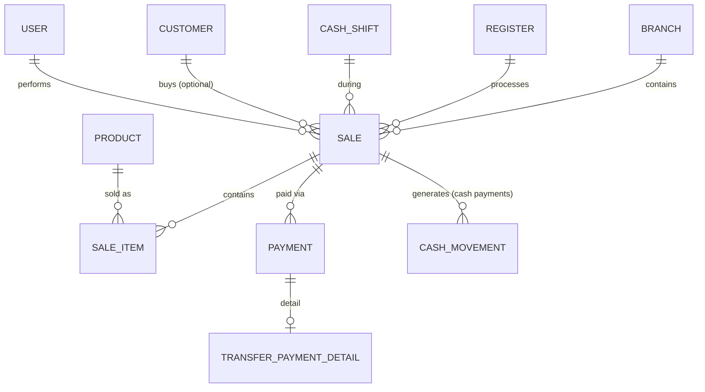

# POS / Sale — Diseño

**Fecha:** 2026-07-05
**Estado:** Aprobado para pasar a plan de implementación
**Depende de:** [Bootstrap + RBAC + Branch/Register](2026-07-04-dalventa-design.md), [Product/BranchInventory](2026-07-05-product-inventory-design.md), [CashShift/Denominaciones](2026-07-05-cashshift-denominaciones-design.md) (los tres mergeados a `main`)
**Precede a:** Credit/CuentasPorCobrar

## 1. Resumen

Cuarto módulo de dominio: la venta al detalle. Une los tres módulos anteriores en un solo flujo — `Sale`/`SaleItem` descuentan inventario vía `InventoryMovementService.recordMovement` (ya existente), los pagos en efectivo persisten cambio vía `CashMovementService.recordMovement` (ya existente, extendido con un campo `saleId`), y toda venta exige un `CashShift` abierto en la caja donde ocurre.

## 2. Alcance de este módulo

**Incluido:**
- `Sale`/`SaleItem`: creación de venta con línea de productos, snapshot de precio (venta o mayoreo) e impuesto al momento de la venta.
- Pagos `CASH`, `TRANSFER` y mixtos (varios `Payment` por venta).
- Cálculo de cambio en efectivo persistido (no solo preview) reusando `ChangeSuggestionCalculator` + `CashMovementService`.
- Descuento a nivel de venta (`discountAmount`), gateado por `SALE_DISCOUNT`.
- Anulación básica de venta (`Sale.status = VOIDED`), solo mientras el turno de esa venta sigue abierto: revierte inventario y revierte los movimientos de caja exactos que la venta generó.

**Explícitamente fuera de alcance (diferido):**
- **Crédito como método de pago** — depende de `CustomerCreditProfile`/límite/vencimiento, que es el siguiente módulo (Credit/CuentasPorCobrar).
- **Devoluciones parciales** (`Return`/`ReturnItem`) — la anulación de este módulo es todo-o-nada, no hay devolución de una sola línea.
- **Ventas suspendidas** (`SuspendedSale`).
- **Anulación después del cierre del turno** — este módulo solo permite anular mientras `CashShift.status = OPEN`; anular contra un turno ya cerrado (que exige generar el ajuste en el turno *actual*, no reabrir el cerrado) es una extensión de una fase posterior.
- **Política configurable de "sin cambio exacto"** — si el algoritmo no encuentra combinación exacta, la venta en efectivo se rechaza con `400`; no hay `TenantSettings` para permitir/autorizar/registrar diferencia (mismo principio YAGNI que el módulo CashShift).

## 3. Modelo de datos

### 3.1 Entidades nuevas

```
Sale (tenant-scoped)
  - branchId: UUID          // derivado del Register, nunca aceptado directo del cliente
  - registerId: UUID
  - cashShiftId: UUID
  - customerId: UUID (nullable — null = "Cliente de contado")
  - userId: UUID             // cajero que hizo la venta
  - status: enum { COMPLETED, VOIDED }
  - subtotal: BigDecimal(14,2)
  - taxTotal: BigDecimal(14,2)
  - discountAmount: BigDecimal(14,2)   // default 0
  - total: BigDecimal(14,2)
  - voidedAt: Instant (nullable)
  - voidedBy: UUID (nullable)
  - voidReason: String (nullable)

SaleItem (tenant-scoped)
  - saleId: UUID
  - productId: UUID
  - quantity: int
  - unitPrice: BigDecimal(12,2)    // snapshot: Product.salePrice o .wholesalePrice al momento de venta
  - taxRate: BigDecimal(5,2)       // snapshot de Product.taxRate
  - lineTotal: BigDecimal(14,2)    // (unitPrice * quantity) * (1 + taxRate/100)

Payment (tenant-scoped)
  - saleId: UUID
  - method: enum { CASH, TRANSFER }
  - amount: BigDecimal(14,2)       // porción del total que cubre este pago

TransferPaymentDetail (tenant-scoped)
  - paymentId: UUID
  - bank: String
  - reference: String
  - amount: BigDecimal(14,2)
  - UNIQUE (tenant_id, bank, reference)   // rechaza referencia duplicada con 409, siempre activo
```

### 3.2 Cambio a entidad existente

`CashMovement` (módulo CashShift) gana una columna nullable `sale_id UUID REFERENCES sales(id)`. Los movimientos que una venta genera (recibido/cambio) se etiquetan con el id de la venta; los movimientos manuales (entrada/retiro/gasto de Task 3 del módulo anterior) siguen con `sale_id = NULL`. Esto permite que la anulación de una venta encuentre exactamente qué movimientos revertir, sin depender de parsear el texto de `reason`.

### 3.3 Diagrama entidad-relación



### 3.4 Reglas de negocio

1. **Toda venta exige un `CashShift` abierto** en el `registerId` indicado — validado antes de tocar inventario o caja.
2. **`branchId` se deriva del `Register`**, nunca se acepta como campo independiente del request (evita inconsistencia branch/register).
3. **El backend recalcula todo**: `subtotal`, `taxTotal`, `total`, cambio — nunca confía en un total que el frontend calculó. `unitPrice`/`taxRate` de cada línea se toman de `Product` en el momento de la venta, no del request.
4. **Snapshot de precio**: `SaleItem.unitPrice` se congela al crear la venta. Un cambio posterior en `Product.salePrice` no altera facturas ya emitidas.
5. **Pago mixto**: la suma de `Payment.amount` debe igualar `Sale.total` exactamente (después de descuento) — si no, `400`.
6. **Cambio en efectivo real (no preview)**: para cada `Payment` de tipo `CASH`, el request incluye las denominaciones que el cliente entregó. El backend:
   - Suma esas denominaciones al `currentQuantity` vigente del turno (mismo criterio que el preview de CashShift).
   - Corre `ChangeSuggestionCalculator.suggest(...)` sobre `(recibido − payment.amount)`.
   - Si hay combinación exacta: persiste `CashMovement(ENTRY, denominaciones recibidas, saleId)` y, si el cambio es mayor a cero, `CashMovement(WITHDRAWAL, combinación de cambio, saleId)` — ambos vía `CashMovementService.recordMovement` (reutilizado tal cual, sin duplicar lógica de mutación/bloqueo).
   - Si NO hay combinación exacta: `400`, la venta completa se rechaza (transacción íntegra, nada se persiste — ni inventario ni pagos previos de esta misma venta).
7. **Descuento**: `Sale.discountAmount > 0` exige que el usuario tenga el permiso `SALE_DISCOUNT`; si no lo tiene, el campo se ignora silenciosamente y el descuento es 0 (no es un error — el cajero sin permiso simplemente no puede aplicar descuento, la venta se completa sin él).
8. **Selección de precio de mayoreo**: cada `SaleItem` del request puede marcar `useWholesalePrice: true` para usar `Product.wholesalePrice` en vez de `Product.salePrice` — no requiere permiso especial (es un precio de lista legítimo, no una modificación arbitraria). Un precio distinto a ambos (override real) queda fuera de alcance (`SALE_PRICE_OVERRIDE` reservado para una fase posterior).
9. **Anulación (`SALE_VOID`)**: solo si `Sale.status == COMPLETED` y `CashShift.status == OPEN` (el turno de esa venta específica, no cualquier turno). Reversión exacta:
   - Por cada `SaleItem` cuyo producto tiene `tracksInventory = true`: `InventoryMovementService.recordMovement(ENTRY, cantidad original, "Anulación venta {id}")`.
   - Por cada `CashMovement` con `saleId = esta venta`: crea el movimiento inverso (`ENTRY`↔`WITHDRAWAL` intercambiados) con las MISMAS denominaciones — no recalcula, replica exacto.
   - Marca `status = VOIDED`, `voidedAt`, `voidedBy`, `voidReason` (obligatorio, `@NotBlank`).
10. **Borrado lógico / inmutabilidad**: una venta nunca se elimina físicamente; anular es un cambio de estado, preservando `Sale`/`SaleItem`/`Payment` completos para historial.

## 4. Permisos

Reusa el catálogo existente — no se agregan códigos nuevos:

| Endpoint | Permiso |
|---|---|
| `POST /api/sales` | `SALE_CREATE` |
| `GET /api/sales`, `GET /api/sales/{id}` | `SALE_CREATE` (ver una venta es parte de operar el POS, mismo criterio que `CASHSHIFT_OPEN` cubriendo apertura+movimientos) |
| `POST /api/sales/{id}/void` | `SALE_VOID` |
| Aplicar `discountAmount > 0` | `SALE_DISCOUNT` (verificado en servicio, no en `@PreAuthorize` del endpoint — el endpoint es el mismo `POST /api/sales` para todos) |

## 5. Endpoints

```
POST   /api/sales                 # crear venta completa (items + pagos)
GET    /api/sales                 # listado (filtros: registerId, cashShiftId — al menos uno requerido)
GET    /api/sales/{id}            # detalle
POST   /api/sales/{id}/void       # {voidReason}
```

## 6. Casos especiales

| Caso | Resolución |
|---|---|
| Vender sin turno abierto en esa caja | `404` (mismo patrón `ResourceNotFoundException` que el resto del proyecto) |
| Suma de pagos ≠ total | `400` |
| Producto sin stock suficiente | `400`, vía `InventoryMovementService` (ya lo maneja) — venta completa se revierte |
| Cambio sin combinación exacta | `400`, venta completa se revierte, ningún pago ni movimiento de inventario queda a medias |
| Referencia de transferencia duplicada (mismo banco, mismo tenant) | `409` |
| Descuento sin permiso `SALE_DISCOUNT` | Se ignora (descuento = 0), la venta se completa igual — no es un error |
| Anular venta con turno ya cerrado | `400`/`409` — "no se puede anular, el turno de esta venta ya está cerrado" (diferido a fase posterior el ajuste-en-turno-actual) |
| Anular venta ya anulada | `409` |
| Venta de producto de otro tenant/branch/register | `404`, mismo patrón tenant-check ya establecido en todo el proyecto |

## 7. Riesgos técnicos y notas de la codebase

- **Transacción atómica real**: la creación de venta hace múltiples llamadas a servicios existentes (`InventoryMovementService`, `CashMovementService`) dentro de un único método `@Transactional` — todas comparten la misma transacción (propagación `REQUIRED` por defecto), así que cualquier excepción intermedia revierte todo. No usar `REQUIRES_NEW` en ninguna de estas llamadas anidadas.
- **Concurrencia**: ya cubierta por los mecanismos existentes — `InventoryMovementService` usa `@Lock(PESSIMISTIC_WRITE)` sobre `BranchInventory`, `CashMovementService` sobre `CashShiftDenomination`. Este módulo no introduce nueva lógica de bloqueo, solo la reutiliza.
- **Lección de módulos anteriores**: nunca `ResponseStatusException` desnudo; usar `ResourceNotFoundException`/`DuplicateResourceException`/`IllegalArgumentException` según corresponda.
- **Jackson SNAKE_CASE global**: todo campo camelCase multi-palabra necesita `@JsonProperty` explícito; todo `BigDecimal` en un DTO de respuesta necesita `@JsonFormat(shape = STRING)` (lección de Product/BranchInventory — Jayway JsonPath compara como String).
- **Migraciones**: el directorio termina en `V16__cash_movements.sql`; este módulo continúa desde `V17`, e incluye una migración de `ALTER TABLE cash_movements ADD COLUMN sale_id ...` (nullable, sin backfill necesario ya que no hay ventas previas).
