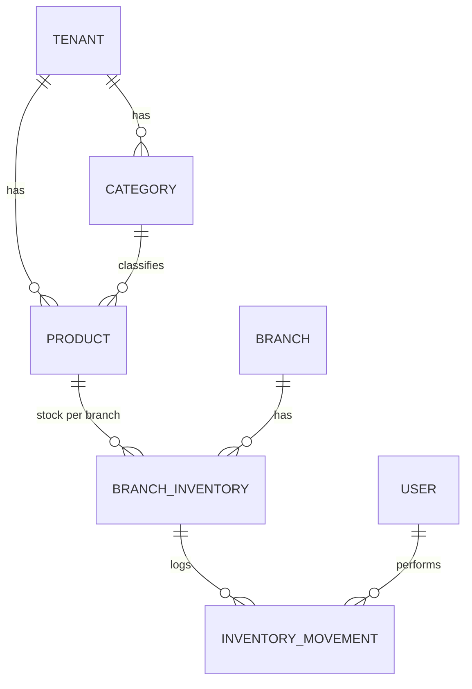

# Product / BranchInventory — Diseño

**Fecha:** 2026-07-05
**Estado:** Aprobado para pasar a plan de implementación
**Depende de:** [Bootstrap + RBAC + Branch/Register](2026-07-04-dalventa-design.md) (ya implementado y mergeado a `main`)
**Precede a:** CashShift/Denominaciones/Algoritmo de cambio, POS/Sale, Credit/CuentasPorCobrar

## 1. Resumen

Segundo módulo de dominio de DaleVenta: catálogo de productos y control de inventario por sucursal. Reemplaza por completo el módulo `inventory`/`Product` heredado de TallerFacilRD (auto-partes), que fue eliminado en la revisión final del branch anterior por pertenecer al dominio equivocado y no tener aislamiento por sucursal.

Sigue el mismo patrón ya establecido por `branch`/`register`: entidades `TenantAwareEntity`, CRUD REST tenant-scoped, permisos granulares vía `@PreAuthorize("@permissionService.has('CODE')")` sobre el bean `permissionService` (ya existente, no se introduce un segundo mecanismo).

## 2. Alcance de este módulo

**Incluido:**
- `Category`: catálogo simple de categorías por tenant.
- `Product`: catálogo de productos por tenant (no por sucursal — el producto es el mismo en toda la empresa, el stock es lo que varía por sucursal).
- `BranchInventory`: existencia de cada producto en cada sucursal, con mínimo/máximo configurable.
- `InventoryMovement`: registro auditado de toda entrada, salida y ajuste de inventario — nunca se actualiza `currentStock` directamente sin dejar rastro.
- Consulta de productos con stock bajo/excedido (`GET /api/inventory/low-stock`), calculada al momento de la consulta.
- Permisos granulares reusando el mecanismo existente: ocultar costo/precio según `COST_VIEW`/`PRICE_VIEW`.

**Explícitamente fuera de alcance (diferido a módulos posteriores):**
- **Cuadre de inventario por turno** (`InventoryCount`, conteo inicial/final vs esperado) — depende de `CashShift`, que no existe todavía. Se agrega cuando el módulo CashShift/POS se implemente.
- **Transferencias entre sucursales** — el modelo de datos (`BranchInventory` por sucursal) ya lo soporta a futuro sin cambios de esquema, pero la lógica de transferencia (dos movimientos ligados en una transacción) no se construye en este módulo.
- **Imagen de producto** — campo y subida vía `StorageService` se agregan en una fase posterior; no bloquea nada del flujo de venta.

## 3. Modelo de datos

### 3.1 Entidades

```
Category (tenant-scoped)
  - name: String
  - active: boolean (default true)

Product (tenant-scoped)
  - categoryId: UUID (FK -> categories)
  - internalCode: String (único por tenant)
  - barcode: String (opcional, único por tenant cuando no es null)
  - description: String
  - unit: String                     // "unidad", "libra", etc. — texto libre, sin catálogo separado
  - cost: BigDecimal(12,2)
  - salePrice: BigDecimal(12,2)
  - wholesalePrice: BigDecimal(12,2)
  - taxRate: BigDecimal(5,2)         // porcentaje, ej. 18.00
  - tracksInventory: boolean (default true)  // si false, se puede vender sin control de existencia
  - active: boolean (default true)

BranchInventory (tenant-scoped)
  - branchId: UUID (FK -> branches)
  - productId: UUID (FK -> products)
  - currentStock: int (default 0)
  - minStock: int (default 0)
  - maxStock: int (nullable — sin máximo configurado si es null)
  - UNIQUE (branch_id, product_id)

InventoryMovement (tenant-scoped)
  - branchInventoryId: UUID (FK -> branch_inventory)
  - type: enum { ENTRY, EXIT, ADJUSTMENT }
  - quantity: int                    // siempre positivo; el signo lo da `type`
  - previousStock: int
  - newStock: int
  - reason: String
  - userId: UUID (quién ejecutó el movimiento)
  - createdAt: Instant (heredado de BaseEntity)
```

### 3.2 Diagrama entidad-relación



### 3.3 Reglas de negocio

1. **`currentStock` nunca se modifica directamente.** Toda entrada/salida/ajuste crea un `InventoryMovement` y actualiza `BranchInventory.currentStock` dentro de la misma transacción — mismo principio que "no confíes en el frontend" del diseño general: el backend recalcula `newStock = previousStock ± quantity` y lo persiste junto al movimiento.
2. **`EXIT` no puede dejar `currentStock` negativo.** Si la cantidad solicitada excede la existencia, la operación se rechaza (`400 INSUFFICIENT_STOCK`). (La venta que descuenta inventario — módulo POS, no este — decide su propia política de bloqueo; este módulo solo expone el movimiento crudo.)
3. **`ADJUSTMENT` es el único tipo que puede mover el stock en cualquier dirección** (positiva o negativa) sin la restricción de `EXIT`, ya que representa una corrección manual (conteo físico, merma, etc.) — exige `reason` obligatorio.
4. **Un producto con `tracksInventory = false`** no requiere fila en `BranchInventory` para poder listarse/venderse más adelante (ej. servicios, productos por encargo); el endpoint de creación de producto no crea automáticamente una fila de inventario — esa se crea explícitamente vía "entrada inicial" cuando el producto llega a una sucursal.
5. **Borrado lógico:** eliminar/desactivar un producto es `active = false`, nunca DELETE — un producto con historial de movimientos no puede perder su rastro.

## 4. Permisos

Reusa el catálogo `PermissionCode` ya existente (§6 del diseño general, ya sembrado en `V9__permissions.sql`): `INVENTORY_VIEW`, `INVENTORY_CREATE`, `INVENTORY_EDIT`, `INVENTORY_ADJUST`, `COST_VIEW`, `PRICE_VIEW`. No se agregan códigos nuevos — ya estaban previstos.

| Endpoint | Permiso |
|---|---|
| `GET /api/categories`, `GET /api/products`, `GET /api/inventory/*` | `INVENTORY_VIEW` |
| `POST /api/categories`, `POST /api/products` | `INVENTORY_CREATE` |
| `PUT /api/products/{id}` | `INVENTORY_EDIT` |
| `POST /api/inventory/movements` (entrada/salida/ajuste) | `INVENTORY_ADJUST` |

**Ocultar costo/precio:** `ProductService` resuelve `PermissionResolutionService.has(user, COST_VIEW)` / `has(user, PRICE_VIEW)` al construir el `ProductResponse` — si no los tiene, `cost`, `salePrice` y `wholesalePrice` viajan como `null` en el mismo DTO (no hay un segundo DTO "completo"). Esto es consistente con: un mismo endpoint sirve a todos los roles, y el frontend simplemente no muestra un campo `null`.

## 5. Endpoints

```
GET    /api/categories
POST   /api/categories

GET    /api/products
POST   /api/products
PUT    /api/products/{id}

GET    /api/inventory/branch/{branchId}          # stock actual de todos los productos en una sucursal
GET    /api/inventory/low-stock?branchId=        # productos con currentStock < minStock (o > maxStock si aplica)
POST   /api/inventory/movements                  # {branchId, productId, type, quantity, reason}
GET    /api/inventory/movements?branchId=&productId=   # historial de movimientos
```

## 6. Casos especiales

| Caso | Resolución |
|---|---|
| Salida (`EXIT`) mayor al stock disponible | `400 INSUFFICIENT_STOCK`, no se persiste el movimiento |
| Ajuste sin `reason` | `400`, validación `@NotBlank` |
| Movimiento sobre producto/sucursal de otro tenant | `404`, mismo patrón tenant-check que `RegisterService` (branch/producto se busca filtrado por `tenantId` antes de operar) |
| Producto con `internalCode` duplicado en el mismo tenant | `409 DUPLICATE_CODE` |
| Barcode duplicado en el mismo tenant | `409 DUPLICATE_BARCODE` (solo si `barcode` no es null) |
| Consultar `low-stock` de una sucursal de otro tenant | `404`, mismo patrón |

## 7. Riesgos técnicos

- **Concurrencia en `BranchInventory.currentStock`:** dos movimientos simultáneos sobre el mismo `(branchId, productId)` deben serializarse — usar `SELECT ... FOR UPDATE` (o bloqueo optimista con `@Version`) al leer `BranchInventory` dentro de la transacción del movimiento, mismo patrón que el diseño general exige para ventas concurrentes (§13 del diseño general).
- **Migración:** el módulo anterior `inventory`/`Product` fue completamente eliminado (incluyendo `V7__products.sql`); esta implementación empieza desde un esquema limpio y no necesita migrar datos existentes.
